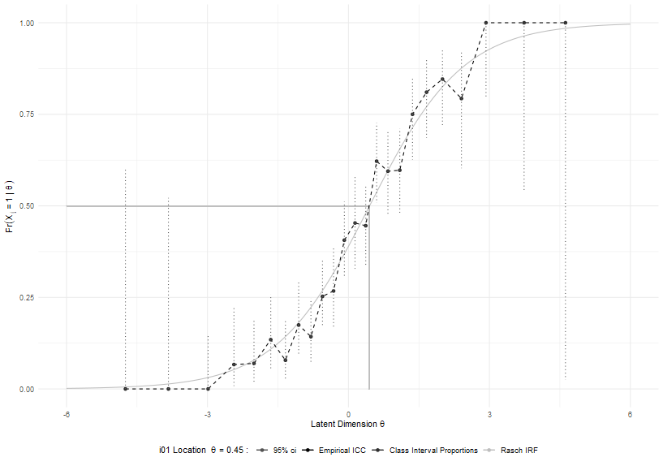
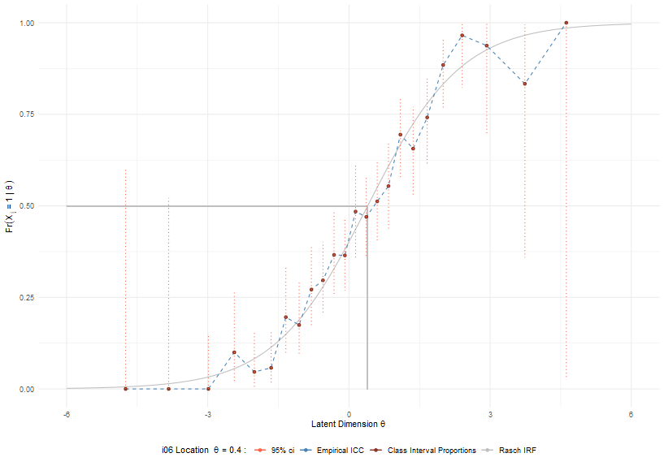
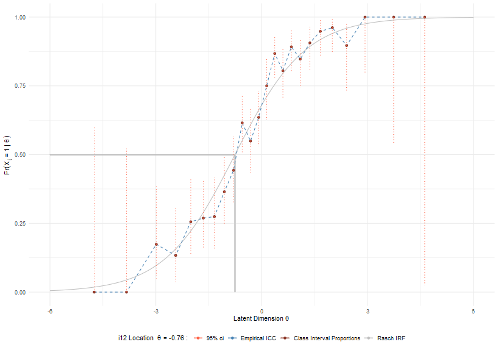
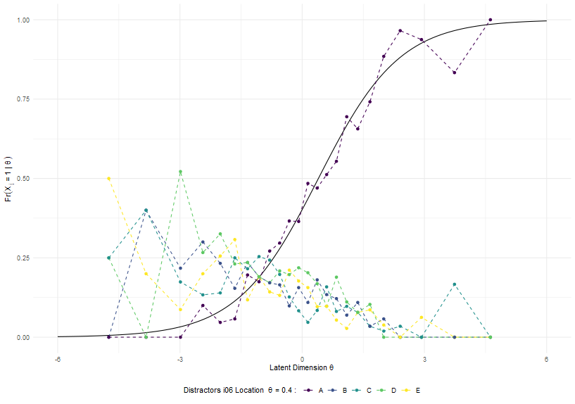
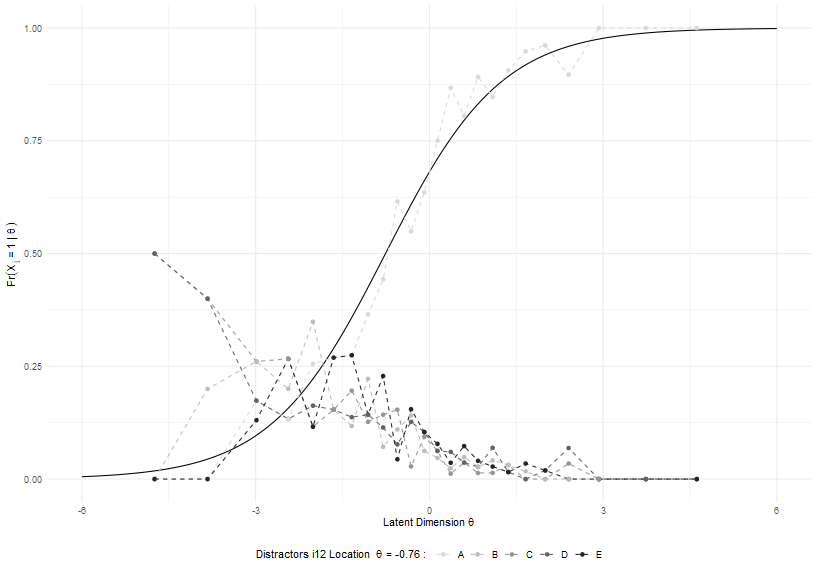

ReadMe
================


## psketti

Generating Investigatory Plots and Tables for Rasch Analysis

## Investigate Item Response Functions

### (0) Load required packages

``` r
library(eRm)
library(ggplot2)
library(psketti)
data(FakeData)  # load dataset fake data

# Set up dataframe for eRm, long to wide with dichotmous data
Fake_Data_scores <- reshape(FakeData[, c("ID", "Item", "X")],
                            timevar = "Item",
                            idvar = "ID",
                            direction = "wide")
names(Fake_Data_scores) <- c("ID", paste0("i", sprintf(fmt  = "%02d", 1:23)))
row.names(Fake_Data_scores) <- Fake_Data_scores$ID
Fake_Data_scores$ID <- NULL

fake_rm <- RM(Fake_Data_scores) # Fit Rasch Model
```

### (1) pskettify your data

Convert your data into a format for psketti to use. Select confidence
levels for empirical class interval values for empirical Item
Chracteristic Curves (ICC), and set the minimum and maximum x axis
values for the Rasch Item Response Function (IRF).

``` r
psk_data <-pskettify(eRm.obj = fake_rm, conf.level = .95, Theta.lwr = -6, Theta.upr = 6)
```

### (2) Plot Rasch IRF curves

Plot IRFs for individual items with empirical ICC, and class interval
averages with confidence intervals

``` r
# plot ICC for one item
psk_6_present <- psketto(psk_data, item = "i01", style = "present", item.label = "i01")   # colour
psk_6_present
```


``` r
psk_6_print   <- psketto(psk_data, item = "i06", style = "print", item.label = "i06")     # black and white
psk_6_print
```

 …or use psketti() to plot ICC
for all plots

``` r
# plot ICC for one item
psk_IRF <- psketti(psk_data)
psk_IRF[["i06"]]
psk_IRF[["i12"]]
```

|            Call 1             |            Call 2             |
|:-----------------------------:|:-----------------------------:|
|  |  |

## Investigate distractor options

### (1) tabliatellify your data

``` r
# response option categories
r_o <- factor(sort(unique(FakeData$K)), levels = sort(unique(FakeData$K)), ordered = TRUE)
tlt_data <- tabliatelle(x = FakeData, ID = "ID", Item = "Item", K = "K", 
                        response_options = r_o, eRm.obj = fake_rm)
```

### (2) Plot the distractor empirical ICC against the dichotomous Rasch ICC

``` r
spag_plot <- spaghetti_plot(ID = "ID", Item = "Item", K= "K", x = FakeData, eRm.obj = fake_rm, 
                            response_options = r_o, p.style = "present")
spag_plot[["i06"]][[1]]
```



``` r
spag_plot <- spaghetti_plot(ID = "ID", Item = "Item", K= "K", x = FakeData, eRm.obj = fake_rm, 
                            response_options = r_o, p.style = "print")
spag_plot[["i12"]][[1]]
```


