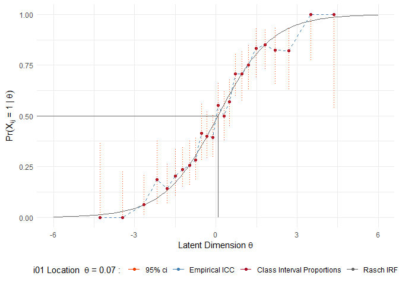
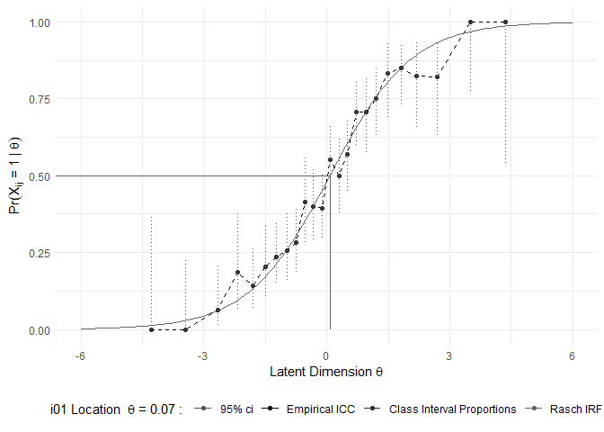
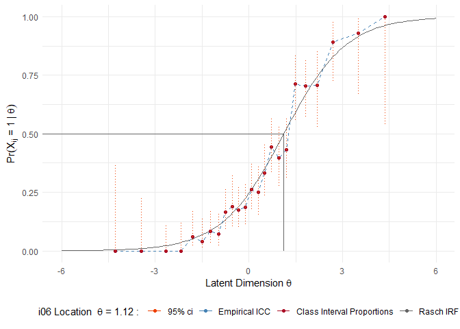

# psketti 

psketti is a package for generating investigatory plots and tables for
Rasch Analysis. Models should first be estimated using eRm, psketti then
pskettifies your Rasch data and produces outputs using ggplot2.

## Installation

``` r
devtools::install_github("SBGalvin/psketti") # install
```

## Loading

Loading psketti will produce the below startup message. If any of the
dependencies are already loaded psketti will tell you. If the
dependencies are not installed at the time of the loading psketti will
tell you which ones.

``` r
library(eRm)
library(psketti)
```

    -----------------------------------------------------
    Loading psketti v 0.1.0
    Beta Software !!!!


    Dependencies:
        eRm      (1.0.2) already loaded
        dplyr        (1.0.4) already loaded
        ggplot2      (3.3.3) loaded by psketti
        viridis      (0.5.1) loaded by psketti


    please install any NOT INSTALLED dependencies using:
    install.packages('dependency')
    -----------------------------------------------------

## Investigate Item Response Functions - Dichotomous Rasch Model

### 1.1 Prepare data

``` r
data("FakeData") # load data
# restructure fake data
Fake_Data_scores <- reshape(FakeData[, c("ID", "Item", "X")],
                           timevar = "Item",
                           idvar = "ID",
                           direction = "wide")
# for eRm new names
names(Fake_Data_scores) <- c("ID",
                             paste0("i",
                                    sprintf(fmt  = "%02d", 1:23)))

row.names(Fake_Data_scores) <- Fake_Data_scores$ID
Fake_Data_scores$ID <- NULL

fake_rm   <- RM(Fake_Data_scores) # Estimate Rasch model
```

### 1.2 pskettify your data

Convert your data into a format for psketti to use. Select confidence
levels for empirical class interval values for empirical Item
Chracteristic Curves (ICC), and set the minimum and maximum x axis
values for the Rasch Item Response Function (IRF).

``` r
psk_data <-pskettify(eRm.obj = fake_rm, conf.level = .95, Theta.lwr = -6, Theta.upr = 6)
```

### 1.3 Plot Rasch IRF curves

Plot IRFs for individual items with empirical ICC, and class interval
averages with confidence intervals

``` r
# plot ICC for one item
psk_1_present <- psketto(psk_data,
                         style = "present",
                         item = "i01",
                         item.label = "i01")
psk_1_present
```

<!-- -->

``` r
psk_1_print <- psketto(psk_data,
                       style = "print",
                       item = "i01",
                       item.label = "i01")
psk_1_print
```

<!-- -->

…or use psketti() to plot ICC for all plots. `psketti()` objects printed
to the console will print suggestions for how to call a plot.

``` r
# plot ICC for one item
psk_IRF <- psketti(psk_data)
psk_IRF
```

    ## Empirical and Theoretical Rasch IRF 
    ## 
    ##  Model:  
    ##  N items:  23 
    ## 
    ## 
    ##  How To call item plots: 
    ## 
    ##    Item                               Call
    ## 1   i01 objectName$Plot.List[['i01']][[1]]
    ## 2   i02 objectName$Plot.List[['i02']][[1]]
    ## 3   i03 objectName$Plot.List[['i03']][[1]]
    ## 4   i04 objectName$Plot.List[['i04']][[1]]
    ## 5   i05 objectName$Plot.List[['i05']][[1]]
    ## 6   i06 objectName$Plot.List[['i06']][[1]]
    ## 7   i07 objectName$Plot.List[['i07']][[1]]
    ## 8   i08 objectName$Plot.List[['i08']][[1]]
    ## 9   i09 objectName$Plot.List[['i09']][[1]]
    ## 10  i10 objectName$Plot.List[['i10']][[1]]
    ## 11  i11 objectName$Plot.List[['i11']][[1]]
    ## 12  i12 objectName$Plot.List[['i12']][[1]]
    ## 13  i13 objectName$Plot.List[['i13']][[1]]
    ## 14  i14 objectName$Plot.List[['i14']][[1]]
    ## 15  i15 objectName$Plot.List[['i15']][[1]]
    ## 16  i16 objectName$Plot.List[['i16']][[1]]
    ## 17  i17 objectName$Plot.List[['i17']][[1]]
    ## 18  i18 objectName$Plot.List[['i18']][[1]]
    ## 19  i19 objectName$Plot.List[['i19']][[1]]
    ## 20  i20 objectName$Plot.List[['i20']][[1]]
    ## 21  i21 objectName$Plot.List[['i21']][[1]]
    ## 22  i22 objectName$Plot.List[['i22']][[1]]
    ## 23  i23 objectName$Plot.List[['i23']][[1]]

``` r
psk_IRF$Plot.List[["i06"]][[1]]
```

<!-- -->

``` r
psk_IRF$Plot.List[["i12"]][[1]]
```

<!-- -->

### 1.4 Item Fit statistics

Produce a table of item fit statistics as per eRm

``` r
itemFit_psk <- item_fit_table(fake_rm)

# round ouput to 2 places
itemFit_psk[, -1] <- round(itemFit_psk[, -1], 2)
itemFit_psk
```

    ##    Item  Beta   Se   Chisq   df OutfitMSQ InfitMSQ OutFitt InFitt Disc
    ## 1   i01  0.07 0.06 1254.23 1185      1.06     1.03    1.20   1.14 0.43
    ## 2   i02 -1.28 0.07 1050.83 1185      0.89     0.97   -1.51  -0.73 0.43
    ## 3   i03 -0.50 0.07 1201.99 1185      1.01     0.98    0.27  -0.83 0.47
    ## 4   i04 -0.18 0.06 1162.84 1185      0.98     0.99   -0.39  -0.32 0.46
    ## 5   i05 -1.80 0.08 1193.75 1185      1.01     0.96    0.10  -0.96 0.37
    ## 6   i06  1.12 0.07 1069.70 1185      0.90     0.96   -1.41  -1.23 0.45
    ## 7   i07 -0.47 0.07 1088.76 1185      0.92     0.94   -1.60  -2.00 0.49
    ## 8   i08  0.04 0.06 1254.05 1185      1.06     1.03    1.20   1.04 0.43
    ## 9   i09  0.39 0.07 1137.96 1185      0.96     0.97   -0.79  -0.91 0.47
    ## 10  i10 -0.11 0.06 1126.51 1185      0.95     0.98   -1.05  -0.68 0.47
    ## 11  i11 -0.26 0.06 1200.84 1185      1.01     1.02    0.27   0.64 0.44
    ## 12  i12 -1.24 0.07 1135.53 1185      0.96     0.97   -0.55  -0.75 0.42
    ## 13  i13  2.32 0.09 1013.78 1185      0.85     0.92   -1.07  -1.46 0.34
    ## 14  i14  1.52 0.08 1055.32 1185      0.89     0.94   -1.27  -1.37 0.43
    ## 15  i15  0.62 0.07 1109.53 1185      0.94     1.00   -1.18   0.03 0.45
    ## 16  i16 -0.95 0.07 1206.06 1185      1.02     0.97    0.28  -0.88 0.44
    ## 17  i17  0.38 0.07 1138.40 1185      0.96     0.98   -0.79  -0.80 0.47
    ## 18  i18  0.55 0.07 1243.40 1185      1.05     0.99    0.90  -0.29 0.45
    ## 19  i19 -0.06 0.06 1239.07 1185      1.04     1.04    0.94   1.43 0.42
    ## 20  i20  0.45 0.07 1190.10 1185      1.00     1.01    0.08   0.33 0.44
    ## 21  i21  0.75 0.07 1257.99 1185      1.06     1.00    1.03  -0.09 0.44
    ## 22  i22 -0.83 0.07 1094.39 1185      0.92     0.97   -1.28  -0.97 0.45
    ## 23  i23 -0.52 0.07 1180.64 1185      1.00     1.03   -0.07   0.90 0.42

Produce Plot of infit and outfit statistics

``` r
psketti_msq(x = itemFit_psk)
```

<!-- -->

### 1.5 Investigate distractor options

``` r
# response option categories
r_o <- factor(sort(unique(FakeData$K)), levels = sort(unique(FakeData$K)), ordered = TRUE)
tlt_data <- tabliatelle(x = FakeData, ID = "ID", Item = "Item", K = "K", 
                        response_options = r_o, eRm.obj = fake_rm)
tlt_data
```

    ## Class Interval Proportion Table 
    ## N Class Intervals: 3 
    ## Class size (n):  1:3: c(178, 844, 178) 
    ## 
    ## Response Options:  Key: A Distractor: B Distractor: C Distractor: D Distractor: E 
    ## 
    ## Data:
    ##    Item  Beta Class Interval Theta    A    B    C    D    E
    ## 1   i01  0.07              1 -2.16 0.13 0.24 0.22 0.17 0.22
    ## 2                          2 -0.04 0.47 0.14 0.12 0.13 0.14
    ## 3                          3  2.16 0.85 0.04 0.04 0.03 0.04
    ## 4   i02 -1.28              1 -2.16 0.31 0.20 0.13 0.19 0.17
    ## 5                          3  2.16 0.98 0.01 0.01 0.00 0.00
    ## 6                          2 -0.04 0.76 0.07 0.06 0.05 0.06
    ## 7   i03  -0.5              3  2.16 0.92 0.03 0.02 0.02 0.02
    ## 8                          1 -2.16 0.16 0.23 0.21 0.23 0.17
    ## 9                          2 -0.04 0.61 0.10 0.09 0.10 0.10
    ## 10  i04 -0.18              2 -0.04 0.53 0.12 0.13 0.09 0.13
    ## 11                         1 -2.16 0.15 0.22 0.20 0.23 0.20
    ## 12                         3  2.16 0.91 0.03 0.02 0.02 0.02
    ## 13  i05  -1.8              2 -0.04 0.85 0.03 0.03 0.04 0.05
    ## 14                         1 -2.16 0.42 0.11 0.13 0.17 0.17
    ## 15                         3  2.16 0.98 0.01 0.01 0.01 0.01
    ## 16  i06  1.12              1 -2.16 0.03 0.28 0.27 0.21 0.21
    ## 17                         3  2.16 0.76 0.06 0.07 0.06 0.05
    ## 18                         2 -0.04 0.24 0.18 0.18 0.20 0.19
    ## 19  i07 -0.47              1 -2.16 0.14 0.22 0.19 0.27 0.17
    ## 20                         3  2.16 0.95 0.01 0.02 0.01 0.02
    ## 21                         2 -0.04 0.60 0.10 0.09 0.09 0.11
    ## 22  i08  0.04              2 -0.04 0.50 0.13 0.13 0.12 0.13
    ## 23                         3  2.16 0.83 0.01 0.05 0.03 0.07
    ## 24                         1 -2.16 0.09 0.24 0.22 0.21 0.24
    ## 25  i09  0.39              2 -0.04 0.39 0.16 0.15 0.15 0.15
    ## 26                         1 -2.16 0.10 0.26 0.20 0.24 0.19
    ## 27                         3  2.16 0.86 0.03 0.04 0.02 0.04
    ## 28  i10 -0.11              1 -2.16 0.11 0.24 0.24 0.22 0.19
    ## 29                         2 -0.04 0.52 0.12 0.12 0.12 0.13
    ## 30                         3  2.16 0.90 0.03 0.02 0.01 0.04
    ## 31  i11 -0.26              3  2.16 0.89 0.03 0.03 0.02 0.02
    ## 32                         1 -2.16 0.20 0.22 0.17 0.17 0.24
    ## 33                         2 -0.04 0.54 0.10 0.11 0.14 0.10
    ## 34  i12 -1.24              3  2.16 0.96 0.02 0.01 0.01 0.00
    ## 35                         2 -0.04 0.75 0.06 0.07 0.06 0.07
    ## 36                         1 -2.16 0.34 0.15 0.15 0.17 0.19
    ## 37  i13  2.32              2 -0.04 0.09 0.23 0.21 0.23 0.23
    ## 38                         3  2.16 0.46 0.12 0.16 0.19 0.07
    ## 39                         1 -2.16 0.01 0.28 0.24 0.24 0.24
    ## 40  i14  1.52              1 -2.16 0.02 0.25 0.24 0.26 0.24
    ## 41                         2 -0.04 0.18 0.20 0.22 0.19 0.21
    ## 42                         3  2.16 0.66 0.04 0.12 0.10 0.09
    ## 43  i15  0.62              1 -2.16 0.01 0.24 0.26 0.25 0.24
    ## 44                         3  2.16 0.78 0.07 0.05 0.06 0.04
    ## 45                         2 -0.04 0.37 0.15 0.16 0.17 0.15
    ## 46  i16 -0.95              3  2.16 0.93 0.01 0.03 0.02 0.01
    ## 47                         1 -2.16 0.22 0.20 0.16 0.22 0.20
    ## 48                         2 -0.04 0.71 0.08 0.09 0.07 0.06
    ## 49  i17  0.38              2 -0.04 0.41 0.15 0.13 0.16 0.15
    ## 50                         1 -2.16 0.06 0.22 0.28 0.24 0.20
    ## 51                         3  2.16 0.85 0.03 0.04 0.03 0.06
    ## 52  i18  0.55              2 -0.04 0.36 0.16 0.17 0.14 0.17
    ## 53                         1 -2.16 0.08 0.25 0.24 0.23 0.20
    ## 54                         3  2.16 0.83 0.06 0.03 0.04 0.03
    ## 55  i19 -0.06              1 -2.16 0.17 0.19 0.23 0.18 0.22
    ## 56                         3  2.16 0.88 0.04 0.02 0.01 0.04
    ## 57                         2 -0.04 0.50 0.10 0.15 0.11 0.14
    ## 58  i20  0.45              1 -2.16 0.12 0.25 0.21 0.26 0.16
    ## 59                         3  2.16 0.83 0.05 0.04 0.04 0.03
    ## 60                         2 -0.04 0.38 0.15 0.14 0.17 0.17
    ## 61  i21  0.75              2 -0.04 0.33 0.18 0.16 0.16 0.17
    ## 62                         3  2.16 0.76 0.06 0.06 0.06 0.06
    ## 63                         1 -2.16 0.06 0.26 0.20 0.25 0.23
    ## 64  i22 -0.83              2 -0.04 0.68 0.08 0.08 0.07 0.09
    ## 65                         1 -2.16 0.21 0.19 0.20 0.20 0.20
    ## 66                         3  2.16 0.96 0.01 0.03 0.00 0.01
    ## 67  i23 -0.52              1 -2.16 0.20 0.19 0.21 0.16 0.23
    ## 68                         2 -0.04 0.61 0.10 0.08 0.11 0.10
    ## 69                         3  2.16 0.92 0.02 0.01 0.02 0.03

### 1.6 Plot the distractor empirical ICC against the dichotomous Rasch ICC

``` r
# multiple plots
spag_plot <- psketti_distractor(ID = "ID",              # set ID column
                                Item = "Item",          # set Item column
                                K= "K",                 # Set resp categories 
                                x = FakeData,           # select data
                                eRm.obj = fake_rm,      # select eRm object
                                response_options = r_o, # set resp options
                                p.style = "present")    # set plotting style
 

spag_plot$Plot.List[['i01']][[1]] # plot item 1
```

<!-- -->

### 1.7 Plot a score report

``` r
K_opt <- factor(LETTERS[1:5], levels = LETTERS[1:5], ordered = TRUE)
score_report <- ingrediente(x = FakeData,
                            Item = "Item",
                            ID = "ID",
                            Score = "X",
                            K = "K",
                            K_options = K_opt,
                            Index = "Index")

# show score report for values with a total score <= 5
score_report[score_report$total_score <= 1, ]
```

    ##             ID total_score String_type                 Pattern
    ## 249  FAKE_0125           1   Responses EECDCCBEEADDDCEDBCEDBCB
    ## 250  FAKE_0125           1       Score 00000000010000000000000
    ## 299  FAKE_0150           0   Responses BECDBEDDDDDCCEDBEBCCCED
    ## 300  FAKE_0150           0       Score 00000000000000000000000
    ## 355  FAKE_0178           1   Responses BCCDBEBCBABCCEECECECEDD
    ## 356  FAKE_0178           1       Score 00000000010000000000000
    ## 457  FAKE_0229           0   Responses DDEBEDCEDCEDBBEDEEBDEBE
    ## 458  FAKE_0229           0       Score 00000000000000000000000
    ## 571  FAKE_0286           1   Responses ECCDBBEDEABDCECDDEDDCDB
    ## 572  FAKE_0286           1       Score 00000000010000000000000
    ## 575  FAKE_0288           1   Responses EBCEDDEDCBACCEBDBBBEBBC
    ## 576  FAKE_0288           1       Score 00000000001000000000000
    ## 631  FAKE_0316           0   Responses CDDDECDDEBEBBBCCCBDDDEC
    ## 632  FAKE_0316           0       Score 00000000000000000000000
    ## 645  FAKE_0323           0   Responses EEBCECDBEBDCDCDEEDEDECB
    ## 646  FAKE_0323           0       Score 00000000000000000000000
    ## 687  FAKE_0344           1   Responses BCCDBBCECCBBCBBCECCEDDA
    ## 688  FAKE_0344           1       Score 00000000000000000000001
    ## 721  FAKE_0361           1   Responses ACEEBEDBBDDEDECBBDCBDDD
    ## 722  FAKE_0361           1       Score 10000000000000000000000
    ## 745  FAKE_0373           0   Responses EDDCCBCCCBDCDEBDDECDDCE
    ## 746  FAKE_0373           0       Score 00000000000000000000000
    ## 903  FAKE_0452           1   Responses DEEEDCCBBEEEEBCDEEBACDB
    ## 904  FAKE_0452           1       Score 00000000000000000001000
    ## 1033 FAKE_0517           1   Responses EACBBBCCEBBCCCDDCDEEBBC
    ## 1034 FAKE_0517           1       Score 01000000000000000000000
    ## 1075 FAKE_0538           1   Responses BADDBCBBBEDCEECDECBECBE
    ## 1076 FAKE_0538           1       Score 01000000000000000000000
    ## 1205 FAKE_0603           0   Responses DBDDBDDEDDCECDCCCCDDDDB
    ## 1206 FAKE_0603           0       Score 00000000000000000000000
    ## 1281 FAKE_0641           1   Responses EBDCDBCECACDBEDDEDBDDBD
    ## 1282 FAKE_0641           1       Score 00000000010000000000000
    ## 1427 FAKE_0714           0   Responses DECDEBECCCBBECBBCBBEBCB
    ## 1428 FAKE_0714           0       Score 00000000000000000000000
    ## 1693 FAKE_0847           1   Responses EEEAEECBEDBCBCCCBDBDEEC
    ## 1694 FAKE_0847           1       Score 00010000000000000000000
    ## 1963 FAKE_0982           0   Responses BBEBBDEEBEBDCCBCBECEDBE
    ## 1964 FAKE_0982           0       Score 00000000000000000000000
    ## 2033 FAKE_1017           1   Responses CDEBCEBEAEDBBEDCCEBEBDB
    ## 2034 FAKE_1017           1       Score 00000000100000000000000
    ## 2181 FAKE_1091           1   Responses CDDEEBBCECADEDDDDECBDEB
    ## 2182 FAKE_1091           1       Score 00000000001000000000000
    ## 2311 FAKE_1156           1   Responses DEECECBEBDDDDCEACDDBDCC
    ## 2312 FAKE_1156           1       Score 00000000000000010000000

## 2 Rasch Partial Credit Model

### 2.1 Prepare data

``` r
data("FakePCMData")

F2           <- FakePCMData
rownames(F2) <- F2$ID
F2$ID        <- NULL

fake_pcm <- PCM(F2)
```

### 2.2 pskettify

``` r
psk_pcm <- pskettify(eRm.obj = fake_pcm) # pskettify
psk_pcm 
```

    ## Model:  PCM 
    ##    Item  K    tau    Se   Beta
    ## 1   i01 c1 -0.809 0.114 -0.882
    ## 2   i01 c2 -1.023 0.115 -0.882
    ## 3   i01 c3 -0.812 0.118 -0.882
    ## 4   i02 c1 -1.591 0.164 -2.212
    ## 5   i02 c2 -2.463 0.156 -2.212
    ## 6   i02 c3 -2.583 0.152 -2.212
    ## 7   i03 c1 -0.404 0.094  0.017
    ## 8   i03 c2 -0.156 0.101  0.017
    ## 9   i03 c3  0.611 0.113  0.017
    ## 10  i04 c1  0.354 0.077  1.589
    ## 11  i04 c2  1.416 0.097  1.589
    ## 12  i04 c3  2.999 0.124  1.589
    ## 13  i05 c1 -0.827 0.102 -0.450
    ## 14  i05 c2 -0.772 0.106 -0.450
    ## 15  i05 c3  0.249 0.118 -0.450
    ## 16  i06 c1 -2.060 0.202 -2.863
    ## 17  i06 c2 -2.979 0.193 -2.863
    ## 18  i06 c3 -3.550 0.184 -2.863
    ## 19  i07 c1 -0.614 0.093 -0.012
    ## 20  i07 c2 -0.181 0.102 -0.012
    ## 21  i07 c3  0.758 0.115 -0.012
    ## 22  i08 c1  0.869 0.072  2.904
    ## 23  i08 c2  2.698 0.107  2.904
    ## 24  i08 c3  5.144 0.163  2.904
    ## 25  i09 c1 -1.026 0.125 -1.270
    ## 26  i09 c2 -1.402 0.124 -1.270
    ## 27  i09 c3 -1.383 0.125 -1.270
    ## 28  i10 c1  1.137 0.074  3.179
    ## 29  i10 c2  2.772 0.104  3.179
    ## 30  i10 c3  5.630 0.177  3.179

### 2.3 Plot PCM ICC

``` r
psk_no_facet <- psketto(pskettified_data = psk_pcm, item = "i01", item.label = "i01")
psk_no_facet
```

<!-- -->

### 2.3 Plot PCM ICC with facet curves

``` r
psk_facet <- psketto(pskettified_data = psk_pcm, item = "i01", item.label = "i01", facet_curves = TRUE)
psk_facet
```

<!-- -->

### 2.4 plot all ICC

By default `psketti()` produces faceted plots for partial credit models

``` r
print_facet <- psketti(pskettified_data = psk_pcm)
print_facet$Plot.List[['i01']][[1]] # output
```

<!-- -->

However, you can turn off this behaviour by using the
`Force_no_facet=True` argument.

``` r
print_no_facet <- psketti(pskettified_data = psk_pcm, p.empICC = FALSE, Force_no_facet = TRUE)
print_no_facet$Plot.List[['i02']][[1]]
```

<!-- -->

### 2.5 PCM item fit

Item fit statistic.

``` r
fake_ifit <- item_fit_table(eRm.obj = fake_pcm)

# round ouput to 2 places
fake_ifit[, -c(1, 2)] <- round(fake_ifit[, -c(1, 2)], 2)
fake_ifit
```

    ##    Item  K   tau   Se   Chisq   df OutfitMSQ InfitMSQ OutFitt InFitt Disc
    ## 1   i01 c1 -0.81 0.11 1027.52 1184      0.87     0.91   -2.40  -2.38 0.63
    ## 2   i01 c2 -1.02 0.11 1027.52 1184      0.87     0.91   -2.40  -2.38 0.63
    ## 3   i01 c3 -0.81 0.12 1027.52 1184      0.87     0.91   -2.40  -2.38 0.63
    ## 4   i02 c1 -1.59 0.16 1035.99 1184      0.87     0.90   -2.02  -2.25 0.57
    ## 5   i02 c2 -2.46 0.16 1035.99 1184      0.87     0.90   -2.02  -2.25 0.57
    ## 6   i02 c3 -2.58 0.15 1035.99 1184      0.87     0.90   -2.02  -2.25 0.57
    ## 7   i03 c1 -0.40 0.09 1140.73 1184      0.96     0.93   -0.76  -1.95 0.64
    ## 8   i03 c2 -0.16 0.10 1140.73 1184      0.96     0.93   -0.76  -1.95 0.64
    ## 9   i03 c3  0.61 0.11 1140.73 1184      0.96     0.93   -0.76  -1.95 0.64
    ## 10  i04 c1  0.35 0.08 1076.29 1184      0.91     0.90   -1.94  -2.52 0.62
    ## 11  i04 c2  1.42 0.10 1076.29 1184      0.91     0.90   -1.94  -2.52 0.62
    ## 12  i04 c3  3.00 0.12 1076.29 1184      0.91     0.90   -1.94  -2.52 0.62
    ## 13  i05 c1 -0.83 0.10 1103.97 1184      0.93     0.95   -1.57  -1.38 0.61
    ## 14  i05 c2 -0.77 0.11 1103.97 1184      0.93     0.95   -1.57  -1.38 0.61
    ## 15  i05 c3  0.25 0.12 1103.97 1184      0.93     0.95   -1.57  -1.38 0.61
    ## 16  i06 c1 -2.06 0.20 1068.63 1184      0.90     0.91   -1.27  -1.91 0.53
    ## 17  i06 c2 -2.98 0.19 1068.63 1184      0.90     0.91   -1.27  -1.91 0.53
    ## 18  i06 c3 -3.55 0.18 1068.63 1184      0.90     0.91   -1.27  -1.91 0.53
    ## 19  i07 c1 -0.61 0.09 1090.34 1184      0.92     0.93   -1.79  -1.74 0.63
    ## 20  i07 c2 -0.18 0.10 1090.34 1184      0.92     0.93   -1.79  -1.74 0.63
    ## 21  i07 c3  0.76 0.12 1090.34 1184      0.92     0.93   -1.79  -1.74 0.63
    ## 22  i08 c1  0.87 0.07 1100.26 1184      0.93     0.92   -1.31  -1.83 0.55
    ## 23  i08 c2  2.70 0.11 1100.26 1184      0.93     0.92   -1.31  -1.83 0.55
    ## 24  i08 c3  5.14 0.16 1100.26 1184      0.93     0.92   -1.31  -1.83 0.55
    ## 25  i09 c1 -1.03 0.13 1083.39 1184      0.91     0.90   -1.41  -2.32 0.61
    ## 26  i09 c2 -1.40 0.12 1083.39 1184      0.91     0.90   -1.41  -2.32 0.61
    ## 27  i09 c3 -1.38 0.12 1083.39 1184      0.91     0.90   -1.41  -2.32 0.61
    ## 28  i10 c1  1.14 0.07  984.57 1184      0.83     0.85   -2.95  -3.59 0.56
    ## 29  i10 c2  2.77 0.10  984.57 1184      0.83     0.85   -2.95  -3.59 0.56
    ## 30  i10 c3  5.63 0.18  984.57 1184      0.83     0.85   -2.95  -3.59 0.56

Infit and Outfit MSQ plot.

``` r
psketti_msq(x = fake_ifit)
```

<!-- -->
